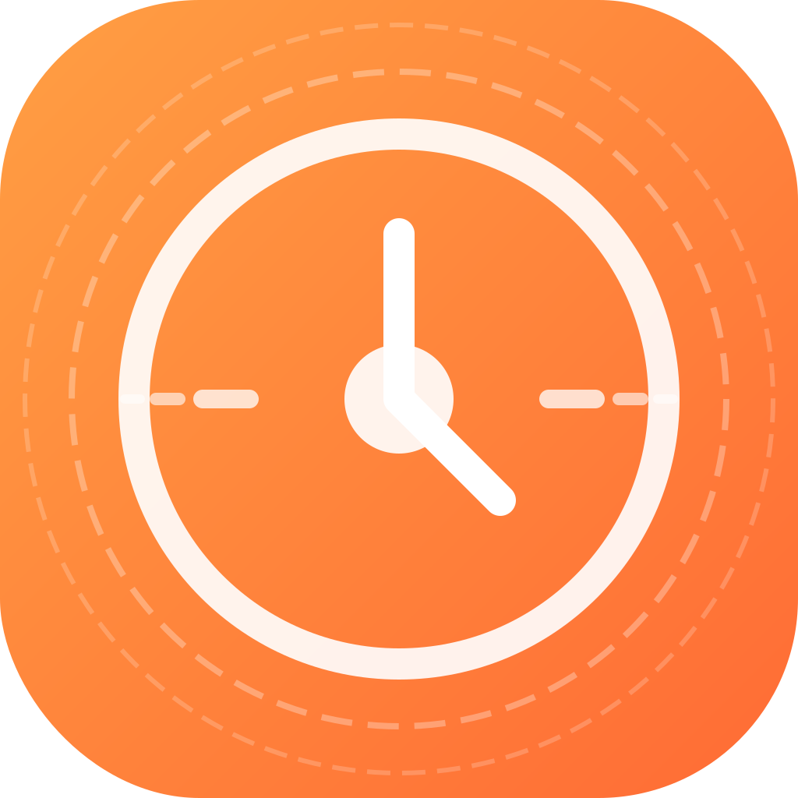

# StayFocused - 专注时钟 & 白噪音应用

<div align="center">
  
  <br/>
  <p>打造专属你的专注与放松环境</p>
</div>

StayFocused 是一个帮助你保持专注的应用，通过自然声音和白噪音创造理想的工作与放松环境。支持Web网页版和桌面应用程序，随时随地提升你的专注力。

*Web体验地址：* https://shutong.work/

## 📖 目录

- [主要功能](#-主要功能)
- [下载安装](#-下载安装)
- [使用指南](#-使用指南)
- [桌面应用特性](#-桌面应用特性)
- [开发指南](#-开发指南)
- [技术栈](#-技术栈)
- [构建发布](#-构建发布)
- [声音资源](#-声音资源)
- [常见问题](#-常见问题)
- [贡献指南](#-贡献指南)
- [许可协议](#-许可协议)

## ✨ 主要功能

- 🎵 **丰富的白噪音库**：包含20+种高质量环境音效，分为自然、雨声、城市三大类
- 🎚️ **自定义声音混音**：可以同时播放多种声音，并调整各声音的音量
- ⏲️ **专注计时器**：内置25/45/60分钟的专注时钟，支持自定义时长
- 💾 **混音保存与加载**：可保存常用的声音组合，随时加载使用
- 🎨 **多主题切换**：提供6种主题颜色，包括温暖橙、极简白、自然绿等
- 🌙 **暗色/亮色模式**：适应不同光线环境，保护视力
- 🖥️ **跨平台支持**：支持Web网页版和桌面应用（macOS/Windows/Linux）
- 📱 **响应式设计**：完美适配各种屏幕尺寸

## 📥 下载安装

### Web版本

直接访问网站体验：[https://shutong.work/](https://shutong.work/)

### 桌面应用版本

#### macOS

1. 下载适合您Mac芯片的安装包：
   - Apple Silicon (M1/M2/M3): [StayFocused-1.0.0-arm64.dmg](https://github.com/daijinhai/StayFocused/releases/download/V1.0.0/StayFocused-1.0.0-arm64.dmg)


2. 打开下载的DMG文件
3. 将StayFocused应用拖到Applications文件夹
4. 首次启动时，如果遇到"无法验证开发者"的提示，请前往系统偏好设置→安全性与隐私，点击"仍要打开"

#### 其他系统版本（请自行源码打包） 

## 🎮 使用指南

### 播放白噪音

1. 选择喜欢的声音类别（自然、雨声、城市）
2. 点击声音图标开始播放
3. 使用滑块调整音量
4. 可以同时播放多种声音，创建个性化混音效果

### 使用专注计时器

1. 在右侧面板选择预设时长（25/45/60分钟）或自定义时间
2. 点击"开始"按钮启动计时器
3. 计时结束后会收到通知提醒
4. 可以选择是否开启结束提示音

### 保存和加载混音

1. 创建喜欢的声音组合后，在右侧"我的混音"区域点击"保存当前混音"
2. 输入混音名称保存
3. 随时点击已保存的混音名称加载使用
4. 通过删除按钮移除不需要的混音

### 切换主题

1. 点击右上角的主题设置按钮
2. 选择喜欢的颜色主题
3. 主题设置会自动保存

## 🖥️ 桌面应用特性

桌面版StayFocused相比Web版本，提供以下额外功能：

1. **离线使用**：无需网络连接，随时随地使用
2. **系统通知**：专注时间结束时发送系统级通知
3. **后台播放**：即使最小化窗口，声音也会继续播放
4. **自启动选项**：可设置为开机自动启动（参见设置）
5. **更流畅的体验**：本地运行，响应更快，无加载延迟

## 🛠️ 开发指南

### 环境要求

- Node.js 16.0.0+（推荐使用Node.js 18 LTS）
- npm 7.0.0+

### 开发环境搭建

```bash
# 克隆仓库
git clone https://github.com/daijinhai/StayFocused.git
cd StayFocused

# 安装依赖
npm install

# 启动Web开发服务器
npm run dev

# 启动Electron开发模式
npm run electron:dev
```

### 项目结构

```
StayFocused/
├── electron/           # Electron相关代码
│   ├── main.cjs        # 主进程
│   └── preload.cjs     # 预加载脚本
├── public/             # 静态资源
│   ├── icons/          # 应用图标
│   └── sounds/         # 声音文件
├── scripts/            # 构建脚本
├── src/                # 源代码
│   ├── components/     # React组件
│   ├── data/           # 数据定义
│   ├── store/          # 状态管理
│   ├── utils/          # 工具函数
│   └── App.tsx         # 应用入口
├── package.json        # 项目配置
└── vite.config.ts      # Vite配置
```

## 🚀 技术栈

- **前端框架**: React 18 + TypeScript
- **状态管理**: Zustand
- **样式方案**: Tailwind CSS
- **构建工具**: Vite
- **桌面应用**: Electron
- **国际化**: i18next
- **图标**: Lucide React

## 📦 构建发布

### Web版本构建

```bash
# 构建Web版本
npm run build

# 预览构建结果
npm run preview
```

构建输出位于 `dist/` 目录，可部署到任何静态网站托管服务。

### 桌面应用构建

#### macOS应用构建

```bash
# 构建macOS ARM版本（Apple Silicon）
npm run dist:mac

# 构建macOS Intel版本
npm run dist:mac-intel

# 构建所有平台版本（需要在对应平台上执行）
npm run dist
```

构建输出位于 `release/` 目录：

- **macOS ARM**: `release/StayFocused-1.0.0-arm64.dmg`
- **macOS Intel**: `release/StayFocused-1.0.0-x64.dmg`

#### Windows应用构建

Windows应用构建需要在Windows系统上执行，或使用虚拟机/容器。以下是构建步骤：

1. **环境准备**

   ```bash
   # 在Windows系统上，打开PowerShell或CMD
   # 安装Node.js 18 LTS和npm

   # 克隆仓库
   git clone https://github.com/daijinhai/StayFocused.git
   cd StayFocused

   # 安装依赖
   npm install
   ```

2. **Windows图标准备**

   Windows应用需要.ico格式的图标文件。在Windows上，需要执行以下步骤：

   ```bash
   # 安装图标转换工具
   npm install -g png-to-ico

   # 在项目根目录创建Windows图标
   mkdir -p public/icons-win
   png-to-ico public/icons/icon-256.png > public/icons-win/icon.ico
   ```

   或者在scripts目录下创建一个Windows图标生成脚本`generate-win-icon.js`：

   ```javascript
   const fs = require('fs');
   const path = require('path');
   const { execSync } = require('child_process');

   // 确保目录存在
   const winIconDir = path.join(__dirname, '../public/icons-win');
   if (!fs.existsSync(winIconDir)) {
     fs.mkdirSync(winIconDir, { recursive: true });
   }

   // 使用ImageMagick转换图标
   try {
     execSync(`magick convert "${path.join(__dirname, '../public/icons/icon-256.png')}" "${path.join(winIconDir, 'icon.ico')}"`);
     console.log('Windows图标生成成功!');
   } catch (error) {
     console.error('生成Windows图标失败:', error.message);
     console.log('请确保已安装ImageMagick: https://imagemagick.org/script/download.php');
   }
   ```

3. **修改package.json**

   在package.json中添加Windows构建脚本和配置：

   ```json
   "scripts": {
     "dist:win": "npm run build && electron-builder --win --x64",
     "dist:win-ia32": "npm run build && electron-builder --win --ia32"
   },
   "build": {
     "win": {
       "icon": "public/icons-win/icon.ico",
       "target": ["nsis"],
       "artifactName": "${productName}-${version}-${arch}.${ext}",
       "publisherName": "YourName"
     },
     "nsis": {
       "oneClick": false,
       "allowToChangeInstallationDirectory": true,
       "createDesktopShortcut": true,
       "createStartMenuShortcut": true
     }
   }
   ```

4. **Windows特殊调整**

   修改`electron/main.cjs`文件，添加Windows平台特定代码：

   ```javascript
   // 在适当位置添加以下代码
   if (process.platform === 'win32') {
     // Windows平台的一些特殊处理
     app.setAppUserModelId('com.stayfocused.app'); // 为Windows通知设置应用ID
   }
   ```

5. **执行Windows构建**

   ```bash
   # 构建64位Windows应用
   npm run dist:win

   # 构建32位Windows应用（如需支持较旧系统）
   npm run dist:win-ia32
   ```

   构建输出位于`release/`目录：
   - **Windows 64位**: `release/StayFocused-1.0.0-x64.exe`
   - **Windows 32位**: `release/StayFocused-1.0.0-ia32.exe`

6. **Windows构建可能遇到的问题及解决方案**

   - **权限问题**：确保以管理员身份运行命令提示符或PowerShell
   - **杀毒软件干扰**：构建过程可能被杀毒软件阻止，可以临时禁用或添加例外
   - **依赖库缺失**：某些Windows特定的库可能需要手动安装：
     ```bash
     npm install --save-dev windows-build-tools
     ```
   - **路径过长错误**：Windows有路径长度限制，确保项目路径不要太深

### 自定义图标

项目包含图标生成脚本，可生成各种尺寸的应用图标：

```bash
# 安装依赖
npm install -g sharp

# 生成图标
node scripts/generate-icons.cjs
```

## 🎵 声音资源

所有声音均来自 [Freesound](https://freesound.org/)，遵循 Creative Commons 许可协议。

### 自然
| 中文名 | 文件名 | 下载地址 |
|-------|--------|----------|
| 森林鸟鸣 | forest-birds.mp3 | https://freesound.org/people/sonidosreales245/sounds/518494/ |
| 海浪 | waves.mp3 | https://freesound.org/people/Pfannkuchn/sounds/360631/ |
| 溪流 | creek.mp3 | https://freesound.org/people/juskiddink/sounds/78955/ |
| 微风 | wind.mp3 | https://freesound.org/people/kangaroovindaloo/sounds/205966/ |
| 树叶沙沙 | leaves-rustling.mp3 | https://freesound.org/people/InspectorJ/sounds/365915/ |
| 瀑布 | waterfall.mp3 | https://freesound.org/people/InspectorJ/sounds/364309/ |
| 篝火 | bonfire.mp3 | https://freesound.org/people/aerror/sounds/350757/ |
| 海滩 | beach.mp3 | https://freesound.org/people/Noted451/sounds/531015/ |
| 夜晚森林 | forest-night.mp3 | https://freesound.org/people/sagetyrtle/sounds/124911/ |

### 雨声
| 中文名 | 文件名 | 下载地址 |
|-------|--------|----------|
| 小雨 | rain-light.mp3 | https://freesound.org/people/tim.kahn/sounds/174031/ |
| 大雨 | rain-heavy.mp3 | https://freesound.org/people/D%20W/sounds/136971/ |
| 屋檐雨声 | rain-roof.mp3 | https://freesound.org/people/Kinoton/sounds/351897/ |
| 窗外雨声 | rain-window.mp3 | https://freesound.org/people/InspectorJ/sounds/346642/ |
| 雷雨 | rain-thunder.mp3 | https://freesound.org/people/lonemonk/sounds/62015/ |
| 雨打树叶 | rain-leaves.mp3 | https://freesound.org/people/reinsamba/sounds/58256/ |
| 雨水潭 | rain-puddle.mp3 | https://freesound.org/people/InspectorJ/sounds/401273/ |

### 城市
| 中文名 | 文件名 | 下载地址 |
|-------|--------|----------|
| 城市交通 | city-traffic.mp3 | https://freesound.org/people/InspectorJ/sounds/475339/ |
| 咖啡馆 | cafe.mp3 | https://freesound.org/people/FoolBoyMedia/sounds/264282/ |
| 键盘声 | keyboard.mp3 | https://freesound.org/people/Dizzon/sounds/324540/ |
| 地铁 | subway.mp3 | https://freesound.org/people/psubhashish/sounds/172496/ |
| 公园 | park.mp3 | https://freesound.org/people/InspectorJ/sounds/421791/ |
| 火车 | train.mp3 | https://freesound.org/people/danielnieto7/sounds/135873/ |

所有声音均经过精心挑选，确保：
- 录音质量高（至少 44.1kHz，16bit）
- 环境音真实自然
- 适合循环播放
- 背景噪音小
- 时长适中（通常 1-3 分钟）

## ❓ 常见问题

### Q: 桌面应用无法播放声音怎么办？
A: 请确保您的系统音量已开启，并且没有其他应用程序独占音频设备。如果问题仍然存在，尝试重启应用程序。

### Q: 如何在系统启动时自动启动应用？
A: 目前需要通过系统设置添加启动项：
- **macOS**: 系统设置 → 用户与群组 → 登录项 → 添加StayFocused
- **Windows**: 右键应用快捷方式 → 属性 → 快捷方式 → 勾选"开机启动"
- **Linux**: 根据不同发行版有不同方法，一般在系统设置中的"启动应用程序"中添加

### Q: 计时器结束没有收到通知？
A: 请确保已授予应用发送通知的权限：
- **macOS**: 系统设置 → 通知与专注模式 → StayFocused → 允许通知
- **Windows**: 设置 → 系统 → 通知和操作 → 允许StayFocused发送通知

### Q: 桌面版与Web版有什么区别？
A: 桌面版提供离线使用、系统通知、后台播放等额外功能，且整体性能更好，不受浏览器限制。

## 🤝 贡献指南

欢迎为StayFocused贡献代码或提供建议！以下是参与项目的方式：

1. Fork本仓库
2. 创建您的特性分支 (`git checkout -b feature/amazing-feature`)
3. 提交您的更改 (`git commit -m 'Add some amazing feature'`)
4. 推送到分支 (`git push origin feature/amazing-feature`)
5. 打开Pull Request

### 贡献类型

- **功能开发**: 添加新功能或改进现有功能
- **Bug修复**: 修复已知问题
- **文档改进**: 完善文档
- **性能优化**: 提高应用性能
- **声音资源**: 贡献高质量声音资源

## 📝 许可协议

本项目采用 [MIT License](LICENSE) 开源许可协议。

---

<div align="center">
  <p>Made with ❤️ by YOUR-NAME</p>
  <p>如果StayFocused对您有所帮助，请考虑给项目一个⭐️</p>
</div>
